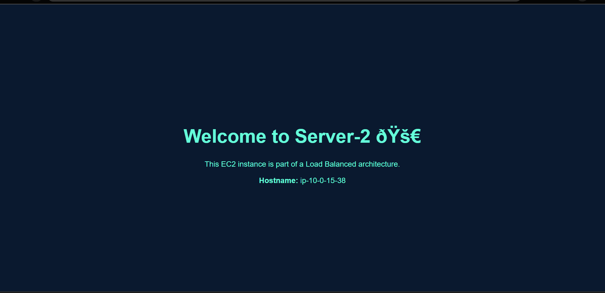

## Step 1: Create a Custom VPC
- Go to **VPC Console → Create VPC**.
- Select **VPC and more**.
- Name: `project-vpc`
- CIDR Block: `10.0.0.0/16`

  

## Step 2: Create Public and Private Subnets
- Create 2 Public Subnets:
  - 10.0.1.0/24 in ap-south-1a
  - 10.0.2.0/24 in ap-south-1b
- Create 2 Private Subnets:
  - 10.0.3.0/24 in ap-south-1a
  - 10.0.4.0/24 in ap-south-1b
- Enable Auto-assign Public IP for public subnets.

### Screenshot:

## Step 3: Launch EC2 Instances
- Go to **EC2 → Launch Instances**.
- Name: `server-1` (repeat for 4 servers).
- AMI: Ubuntu 22.04 LTS
- Instance type: t2.micro
- Add **User Data Script** for NGINX & custom HTML.
- Assign Public IP for public subnets.

### Screenshot:

## Step 4: Create Target Group
- EC2 → Target Groups → Create Target Group.
- Type: Instances.
- Protocol: HTTP (port 80).
- Register all 4 EC2 instances.

### Screenshot:

## Step 5: Create Application Load Balancer
- EC2 → Load Balancers → Create ALB.
- Scheme: Internet-facing.
- Listener: HTTP (port 80).
- Attach Target Group.
- Attach ALB Security Group.

### Screenshot:

## Step 6: Test Load Balancer DNS
- Copy the ALB DNS name.
- Paste in browser → Verify traffic is distributed across servers.

### Screenshot:

### Screenshot:

### Screenshot:

### Screenshot:

  

